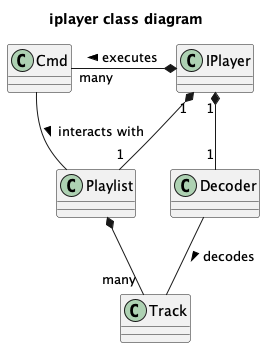
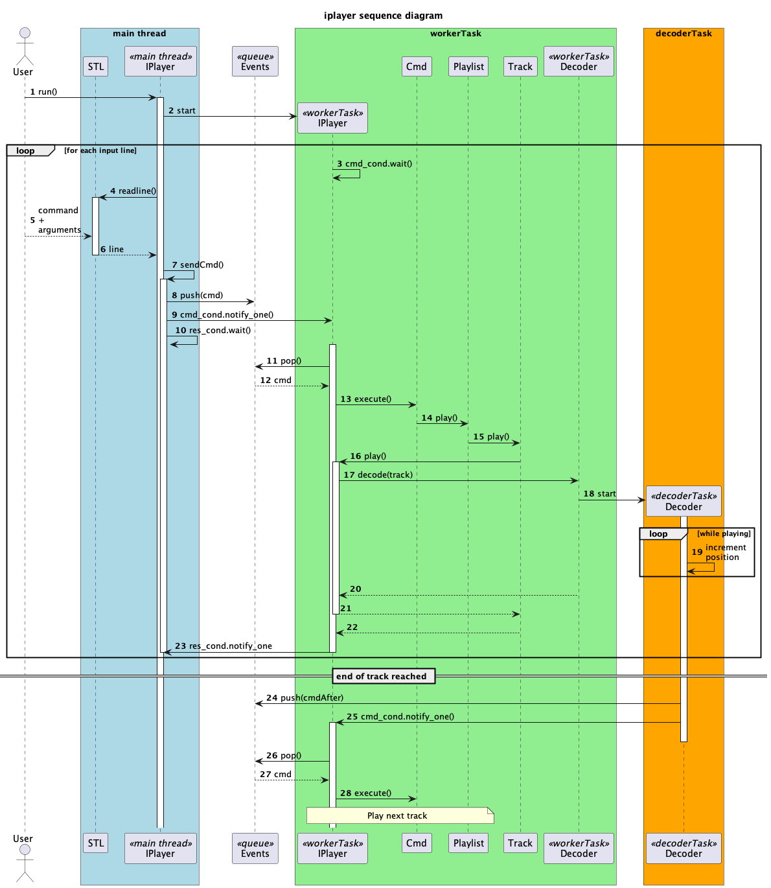

# iplayer
iplayer is an example of audio player written in C++.

### Building
You need a C++ compiler (supporting C++11) and CMake.

```sh
mkdir build
cd build
cmake ..
make
```

### Usage
```sh
iplayer
```

### Help
```sh
iplayer --help
```
The list of commands are:
* **add_track**   : Add a track to the playlist (syntax: add_track <file name>).
* **after**       : Play the following track, either the next one in the playlist or a random one depending on the play mode.
* **clear**       : Clear the playlist.
* **del_dup**     : Remove duplicated tracks in the playlist.
* **del_track**   : Remove a track from the playlist (syntax: del_track <track index>).
* **exit**        : Exit iplayer.
* **help**        : Get this help.
* **load**        : Load a playlist (syntax: load <playlist file>).
* **next**        : Play the next track of the playlist.
* **pause**       : Pause playback.
* **play**        : Start/resume playback.
* **previous**    : Play the previous track of the playlist.
* **save**        : Save the playlist (syntax: save <playlist file>).
* **set_mode**    : Set playback mode (syntax: set_mode <once or loop or random>).
* **show**        : Show the content of the playlist.
* **show_track**  : Show the current track.
* **stop**        : Stop playback.

### Testing
test directory contains some basic shell scripts.

```sh
./test1.sh | tee >(iplayer)
./test2.sh | tee >(iplayer)
./test3.sh | tee >(iplayer)
```

### Software architecture

Simplified class diagram



Simple case of a playback sequence depicting how the three threads interact:
* main thread
* worker thread
* decoder thread



### Copyright
Copyright (C) 2023 Benoit Baudaux

### License
GPLv3
